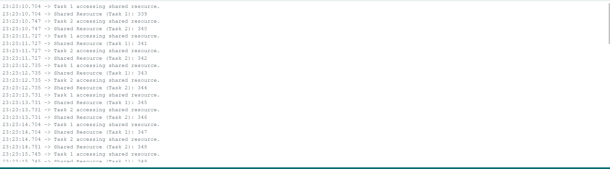
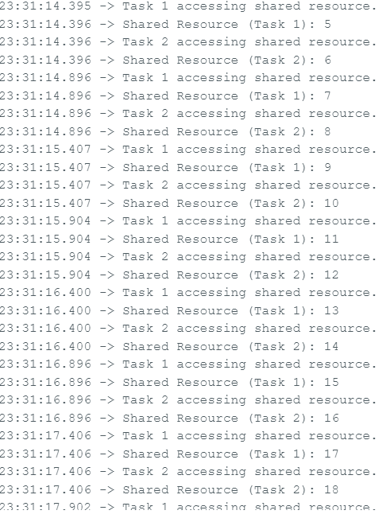
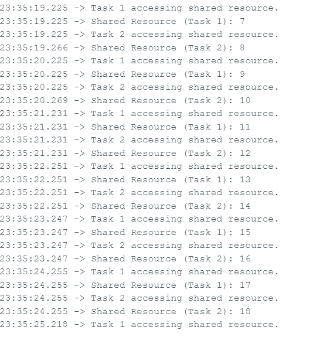
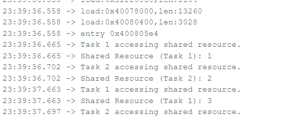
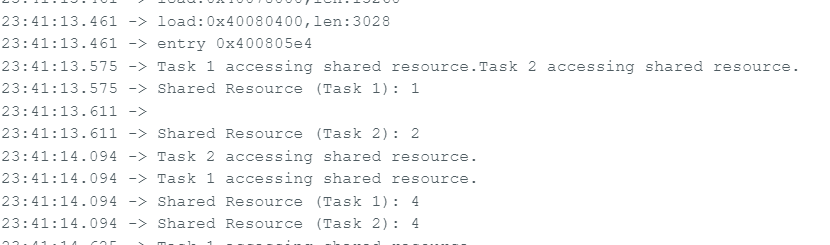
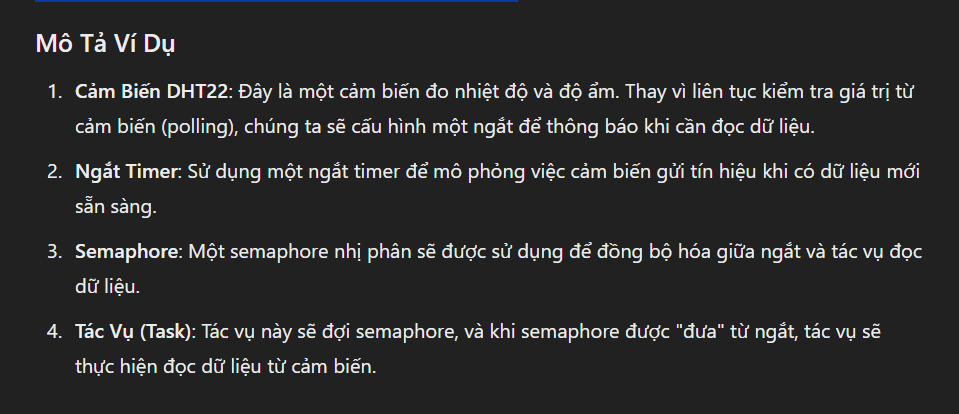

TÌM HIỂU RTOS
---
# Mutexs and Shemaphores
## Binary Semaphores
- Mục đích dùng để loại trừ khi có sự xung đột giữa các task và đồng bộ hóa 
- Semaphores là sự lựa chọn tốt hơn để đồng bộ , còn mutex là sự lựa chọn tốt hơn để loại trừ
- Các hàm API của Semaphore cho phép chỉ định thời gian chờ (block time).
- Thời gian chờ cho biết số lượng 'tick' tối đa mà một tác vụ (task) sẽ chuyển sang trạng thái 
Blocked khi cố gắng 'lấy' một semaphore mà đang không có sẵn Semaphore
- Nếu có nhiều hơn 1 task bị chặn  muốn lấy semaphore thì task có độ ưu tiên cao nhất sẽ đc unblock khi semaphore khả dụng
- Hãy coi semaphore nhị phân như một hàng đợi chỉ có thể chứa một mục. Do đó, hàng đợi chỉ có thể trống hoặc đầy 
(do đó là nhị phân). Các tác vụ và ngắt sử dụng hàng đợi không quan tâm hàng đợi chứa gì - chúng chỉ muốn biết hàng đợi trống 
hay đầy. Cơ chế này có thể được khai thác để đồng bộ hóa (ví dụ) một tác vụ có ngắt.
- Hãy xem xét trường hợp một tác vụ được sử dụng để phục vụ một thiết bị ngoại vi. Việc liên tục kiểm tra (polling) thiết bị ngoại vi sẽ gây lãng 
phí tài nguyên CPU và ngăn cản các tác vụ khác thực thi. Do đó, tốt nhất là task nên dành phần lớn thời gian ở trạng thái Bị chặn (cho phép các tác 
vụ khác thực thi) và chỉ tự thực thi khi thực sự có việc gì đó để nó thực hiện. Điều này đạt được bằng cách sử dụng một binary semaphore ,tác vụ sẽ 
chuyển sang trạng thái Blocked khi cố gắng "lấy" (take) semaphore nếu semaphore không có sẵn. Sau đó, một quy trình ngắt được viết cho thiết bị ngoại 
vi chỉ 'cung cấp' semaphore khi thiết bị ngoại vi yêu cầu bảo trì. Tác vụ luôn 'lấy' semaphore (đọc từ hàng đợi để làm cho hàng đợi trống), nhưng 
không bao giờ 'đưa' nó. Ngắt luôn 'đưa' semaphore (ghi vào hàng đợi để làm cho nó đầy) nhưng không bao giờ lấy nó. Mã nguồn được cung cấp trên trang 
tài liệu xSemaphoreGiveFromISR() sẽ làm rõ điều này. Đồng thời xem thông báo tác vụ RTOS, có thể được sử dụng làm giải pháp thay thế semaphore nhị 
phân có trọng lượng nhanh hơn và nhẹ hơn trong một số trường hợp.
-Cú pháp của xSemaphoreGiveFromISR:
```
BaseType_t xSemaphoreGiveFromISR(
    SemaphoreHandle_t xSemaphore,
    BaseType_t *pxHigherPriorityTaskWoken
);
```
	- xSemaphore: Đây là tham chiếu (handle) đến semaphore mà ISR sẽ "gửi". Semaphore này phải được tạo trước đó bằng cách sử dụng 
	một trong các hàm tạo semaphore như xSemaphoreCreateBinary(), xSemaphoreCreateCounting(), hoặc xSemaphoreCreateMutex().
	-pxHigherPriorityTaskWoken: 
		- Đây là một con trỏ đến một biến kiểu BaseType_t. Biến này sẽ được đặt giá trị bên trong hàm để chỉ ra rằng có một tác vụ 
		có độ ưu tiên cao hơn hiện tại vừa được "đánh thức" (unblocked) do semaphore đã được "gửi".
		- Khi giá trị của biến này là pdTRUE, tức là sau khi ISR kết thúc, hệ thống có thể cần thực hiện một phép chuyển đổi ngữ cảnh 
		(context switch) để đảm bảo rằng tác vụ vừa được đánh thức có thể chạy ngay lập tức nếu nó có độ ưu tiên cao hơn tác vụ hiện tại.
		- Nếu bạn không quan tâm đến việc chuyển đổi ngữ cảnh, bạn có thể truyền giá trị NULL vào tham số này.
	- Giá trị trả về: pdPASS: Nếu semaphore được "gửi" thành công.pdFAIL: Nếu semaphore 
	không được "gửi" do có giới hạn hoặc một lỗi nào đó (thường là vì semaphore đã đầy).
	
-Trong ví dụ này, hai task sẽ cố gắng truy cập vào một tài nguyên dùng chung, nhưng chỉ một task được phép 
truy cập vào tài nguyên tại một thời điểm nhờ vào semaphore, tài nguyên chung ở đây là biến đếm sharedResource;
[Xem code ở đây](binary_semaphore.ino)

[Xem code ở đây](codekodongbo.ino)


- Dễ thấy khi không đồng bộ thời gian giữa các chu kỳ thực thi cả 2 task sẽ có độ lệch lớn hơn, và khi reset chương trình , trường hợp ko có
đồng bộ dễ gây ra sai số dữ liệu đầu ra


- Để minh họa cách một tác vụ có thể phục vụ một thiết bị ngoại vi mà không cần liên tục kiểm tra (polling), chúng ta sẽ sử dụng một ví dụ với 
bộ cảm biến nhiệt độ và độ ẩm DHT11, sử dụng Arduino và FreeRTOS. Trong ví dụ này, chúng ta sẽ sử dụng một semaphore nhị phân để đồng bộ hóa việc
đọc dữ liệu từ cảm biến khi một ngắt (interrupt) xảy ra.

[xem code ở đây](no_polling_peripheral.ino)
