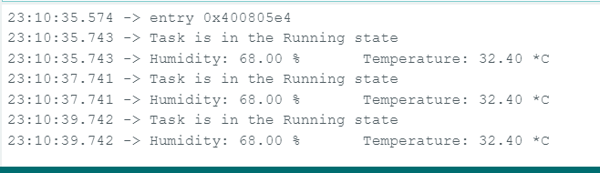
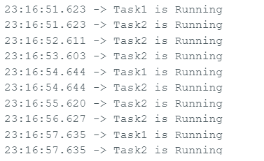
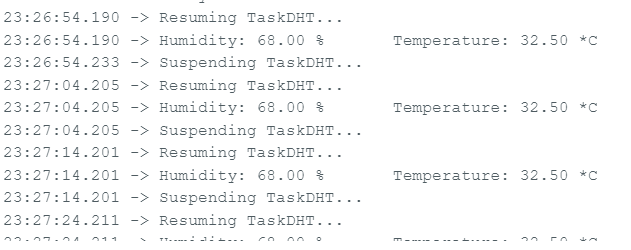

TÌM HIỂU VỀ RTOS
---
[Tài liệu tham khảo RTOS](https://www.freertos.org/Documentation/00-Overview)
[](https://github.com/FreeRTOS/FreeRTOS-Kernel-Book/blob/main/toc.md)

# TASK
## TASK STATE
- 1 Task có thể ở 1 trong các trạng thái sau
	- Running: Khi một tác vụ thực sự được thực thi, nó được cho là ở trạng thái Đang chạy. Nó hiện đang sử dụng bộ xử lý. 
	Nếu bộ xử lý mà RTOS đang chạy chỉ có một lõi thì chỉ có thể có một tác vụ ở trạng thái Đang chạy tại bất kỳ thời điểm nào.
	- Ready: Nhiệm vụ sẵn sàng là những nhiệm vụ có thể thực thi (chúng không ở trạng thái Bị chặn hoặc Bị tạm dừng) nhưng hiện 
	không thực thi vì một nhiệm vụ khác có mức độ ưu tiên bằng hoặc cao hơn đã ở trạng thái Đang chạy.
	- Blocked: Một tác vụ được cho là ở trạng thái Bị chặn nếu nó hiện đang chờ một sự kiện tạm thời hoặc sự kiện bên ngoài. 
	Ví dụ: nếu một tác vụ gọi vTaskDelay() thì nó sẽ chặn (được đặt vào trạng thái Bị chặn) cho đến khi hết thời gian trì hoãn - một
	sự kiện tạm thời. Các tác vụ cũng có thể chặn để chờ hàng đợi, semaphore, nhóm sự kiện, thông báo hoặc sự kiện semaphore. Các tác 
	vụ ở trạng thái Bị chặn thường có một khoảng thời gian 'hết thời gian', sau đó tác vụ sẽ hết thời gian chờ và được bỏ chặn, ngay 
	cả khi sự kiện mà tác vụ đang chờ chưa xảy ra. Các tác vụ ở trạng thái Bị chặn không sử dụng bất kỳ thời gian xử lý nào và không 
	thể được chọn để vào trạng thái Đang chạy.
	- Suspended: Giống như các tác vụ ở trạng thái Bị chặn, các tác vụ ở trạng thái Bị treo không thể được chọn để chuyển sang trạng 
	thái Đang chạy, nhưng các tác vụ ở trạng thái Bị treo không có thời gian chờ. Thay vào đó, các tác vụ chỉ vào hoặc thoát khỏi trạng 
	thái Tạm dừng khi được lệnh rõ ràng thực hiện điều đó thông qua các lệnh gọi API vTaskSuspend() và xTaskResume() tương ứng.

- Ví dụ 
```
#include <DHT.h>
// Define DHT sensor type and pin
#define DHTPIN 4       // DHT sensor pin
#define DHTTYPE DHT11   // DHT11 or DHT22

DHT dht(DHTPIN, DHTTYPE);

// Task handles
TaskHandle_t TaskDHTHandle = NULL;

void setup() {
  Serial.begin(115200);
  dht.begin();

  // Create a task to read DHT sensor data
  xTaskCreatePinnedToCore(
    TaskDHT,         // Function that implements the task
    "TaskDHT",       // Name of the task
    10000,           // Stack size in words
    NULL,            // Task input parameter
    1,               // Priority of the task
    &TaskDHTHandle,  // Task handle
    1);              // Core where the task should run
}

void loop() {
  // Main loop does nothing, all work is done in the TaskDHT function
}

void TaskDHT(void *pvParameters) {
  (void) pvParameters;
      // Read temperature and humidity from the DHT sensor
    float h = dht.readHumidity();
    float t = dht.readTemperature();
  for (;;) {
    // Indicate that the task is in the Running state
    Serial.println("Task is in the Running state");

    // Check if any reads failed and exit early (to try again)
    if (isnan(h) || isnan(t)) {
      Serial.println("Failed to read from DHT sensor!");
    } else {
      // Print the temperature and humidity values to Serial Monitor
      Serial.print("Humidity: ");
      Serial.print(h);
      Serial.print(" %\t");
      Serial.print("Temperature: ");
      Serial.print(t);
      Serial.println(" *C ");
    }

    // Task delay for a while to avoid flooding Serial Monitor
    vTaskDelay(pdMS_TO_TICKS(2000));
  }
}
```

```
// Task handles
TaskHandle_t Task1Handle = NULL;
TaskHandle_t Task2Handle = NULL;

void setup() {
  Serial.begin(115200);

  // Create Task1 with higher priority
  xTaskCreate(
    Task1,       // Function that implements the task
    "Task1",     // Name of the task
    1000,        // Stack size in words
    NULL,        // Task input parameter
    2,           // Priority of the task
    &Task1Handle // Task handle
  );

  // Create Task2 with lower priority
  xTaskCreate(
    Task2,       // Function that implements the task
    "Task2",     // Name of the task
    1000,        // Stack size in words
    NULL,        // Task input parameter
    1,           // Priority of the task
    &Task2Handle // Task handle
  );
}

void loop() {
  // Main loop does nothing, all work is done in the tasks
}

void Task1(void *pvParameters) {
  for (;;) {
    Serial.println("Task1 is Running");
    // Simulate some work by delaying for 1000ms
    vTaskDelay(3000 / portTICK_PERIOD_MS);
  }
}

void Task2(void *pvParameters) {
  for (;;) {
    Serial.println("Task2 is Running");
    // Simulate some work by delaying for 500ms
    vTaskDelay(1000 / portTICK_PERIOD_MS);
  }
}
```

- Ví dụ suspeding & resuming
[xem code mẫu](suspeding_resuming.ino)
